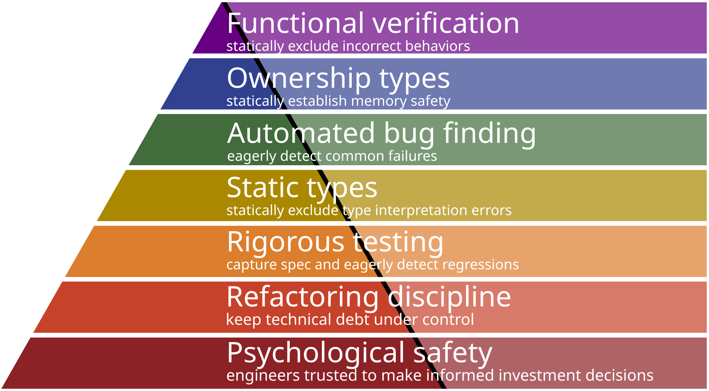

# Maslow’s Hierarchy of Quality

I’ve been in the business of pushing functional verification tooling towards the mainstream. I’m thrilled with the experience of writing code with major classes of functional bugs eliminated at compile time, and compelled by the prospect of bringing these techniques to mainstream systems programming.

I have come to understand, however, that not every team is ready to benefit from verification. If a team is shipping buffer overflows, they’ve got more important things to do: Solving those problems is both higher ROI for the team, and in fact a prerequisite for exploiting verification. I think there’s an analog of Maslow’s Hierarchy of Needs for software development teams, and it works similarly: until you’ve sorted out the needs at level k, you don’t have the resources to invest in level k+1, nor would the benefit be visible amid the problems you’re experiencing from level k.

With apologies to Maslow, then, I offer a Hierarchy of Software Development Quality.

## 0. Psychological safety.

A functional team needs good technical and management leadership that gives the team room to internally make decisions and investments that balance code base stability against feature growth. Absent that air cover, a team doesn’t have the opportunity to climb the hierarchy.

## 1. Well-factored design and code base.

The evidence that code (or its interface to customers) is poorly factored is when a bug report or feature request arrives, all the engineers know it should be implemented in a core module, but nobody is willing to touch that module because it’s far too brittle. Instead, the change is implemented as duct tape at a boundary to the core module. The tangled ball becomes increasingly tangled, and the step cost of refactoring it gets higher with time.

A team functioning well at level 1 pays down this technical debt. While there may be a few modules that could use a rewrite, it’s only module that are rarely involved in incoming issues. That is, the interest accruing on the technical debt is modest.

## 2. Rigorous testing.

A team with good test coverage and good continuous-integration process has reduced the risk of refactoring, which helps prevent decisions that take on technical debt.

## 3. Static types.

A team using a dynamically-typed language is wasting effort catching bugs through testing or at deployment time that could be caught by a compiler before code is even checked in. If you’re writing Python or JavaScript, your team hasn’t achieved level 3.

## 4. Automated bug finders.

If your team uses automated pre-merge bug-finding tools in your CI, you’re reducing risks of refactoring, again warding off technical debt. Valgrind and PREfast are common examples of such tools. At Google, heavy investment in automated pre-merge checks have produced a multiplicity of such bug finders.

## 5. Static ownership types.

Managing memory manually in C is littered with traps, traps that today are well understood. If you’re finding buffer overflows in production, you’re wasting risk and time that could be prevented at compile time. “Rewrite in Rust” sounds like a cult … to people who are content to operate below level 5.

Using a garbage-collected language, when tail latency allows it, is a good choice for preventing some of the more costly bugs associated with poor memory discipline. There are limitations: First, it’s inappropriate for high-performance data path code. Second, it’s still difficult to reason about memory leaks. Most importantly, having a rigorous discipline that helps programmers understand which data can change helps programmers avoid writing functional and concurrency bugs. A GC language is level 4.5; Rust (or disciplined application of `const`-first, `unique_ptr`-first C++) gets you to level 5.

## 6. Static verification of functional correctness.

Only once the lower layers are satisfied can the mature team achieve self-actualization. If you “can’t afford” to exploit static types or ownership types, you are already facing problems more urgent than logic bugs, and you have solutions available to those problems with a better ROI than verification.

Verification obviates some layers. Not every layer must remain in play. Static type checks (L3) exclude certain classes of bugs; once excluded, there’s no need to test (L2) for such cases. Ownership types (L5) exclude another important class of common, painful bugs; once excluded, there’s no need to bug-find (L4) or test (L2) for such cases.

Likewise, functional verification (L6) statically excludes a very wide swath of bugs. The knowledge that a module can only return correct results frees developers to eliminate many behavior tests (L2), but they may need to retain performance regression tests. Some automated bug finders (L4) may be redundant if they search for bugs whose presence would prevent proof of correctness. Lightening the load on testing may free up resources to spend on the (presently higher) cost of verification proof development and maintenance.

Verification emphasizes other layers. The other layers are more important than ever for a team at level 6.

In my experience, being prepared to eagerly refactor (L1) is essential to verification-based development. It’s far easier to argue why code is correct by refactoring it to be clear than by trying to capture all the unkempt hair and tangled complexity of poorly factored code.

Static types (L3) are an obvious cost-benefit win. TLA+ is an untyped language, so users of TLAPS must begin every verification project with a phase of proofs simply to satisfy type safety invariants. That’s a fantastic waste of time in a development context, where static type systems are very well understood to have adequate expressivity and a favorable cost/benefit ratio.

Ownership types (L5) provide a similar win. Our team fought with dynamic frames in Dafny, the “untyped” analog of memory reasoning, for years. Those problems were the worst part of our experience with IronFleet [] and our first draft of VeriBetrFS []. When we switched to a research version of ownership types, we found 30-50% reductions in proof effort and verification time, along with qualitative improvements in process due to elimination of ambiguous error messages (an OOPSLA best paper []). Following on that experience, we went all-in. We built the Verus systems verification language on top of Rust in part to exploit Rust’s mature tooling around ownership types.

## Discussion

### Confident assertions.

We have plenty of professional experience to back up the benefit of each of layers 0-5.

Sure, you’ll find plenty of people who aren’t sold on ownership types yet, perhaps because C is so familiar. There are plenty of people still getting paid to code in PHP and teams that turn a profit despite comically poor testing or mounting technical debt. Indeed, there are certainly dysfunctional teams that are stuck in these situations because their management doesn’t even comprehend the idea of technical debt, much less trust its engineers to make balanced decisions about paying it down. That many organizations succeed despite sloppy practice doesn’t imply that better practice doesn’t pay off for more competent organizations.

### Speculative assertions.

The benefits of layer 6 is still an open question. Myself and others in the systems research community have tasted the euphoria of writing code that’s known to be correct before the first instruction is fetched, and that excitement is motivating! The open question is how far we can drive the price down, and therefore how broadly the techniques can benefit production teams.

Early systems functional verification has been expensive. seL4 required  50–100× as much proof as code for seL4. Many methodologies require PhD students to practice because the languages and tools are esoteric; the process requires users to simultaneously build the system and develop the proof automation toolkit. If verification remains expensive the leap to Hierarchy Level 6 may be too expensive. The ROI may only work out for projects where a bug in deployment costs $100M.

However, we’ve observed the costs coming down an order of magnitude. Research projects in the last decade have proof:code ratios below 10, with some specialized techniques below 1. Some engineering teams have made meaningful progress on protocol verification with training on the scale of weeks instead of years. Both the combination of constantly-improving usability and redirection of resources from test maintenance to proof maintenance improve ROI, putting verification within reach of more production systems. This trend is the primary reason I’m working in this space. It’s also the reason I focus my work on tool usability and burden reduction.

### Generalizing verification.

For simplicity, I have focused L6 on functional verification: for example, proving that every result returned by a database system has a correct value. Researchers call these “safety properties.”

Verification can be used to prove many more properties: Liveness says that a system always eventually replies to its requests; think freedom from deadlock. Performance (a type of safety property) proves that a system replies within a fixed deadline. Security properties include secrecy, privacy, and integrity properties that may not fit into a simple functional safety statement. Contemporary research is showing how such properties can be fit into practical systems, and is striving to reduce the cost.

All of these broader-scope properties are interesting for the same reason functional verification is: they exclude every bug in some broad class at compile time. However, the techniques for these more-advanced properties are less well studied and farther from reduced to practice than basic functional verification, so they aren’t yet as well-positioned for favorable ROI. For that reason, I predict production successes will arrive first with functional verification.

